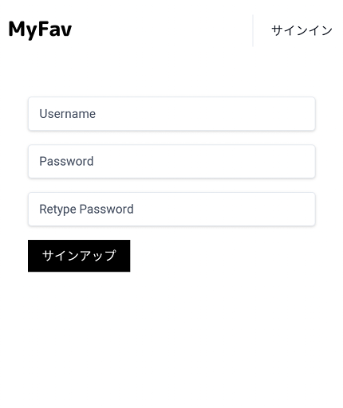
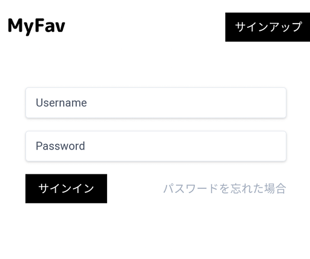
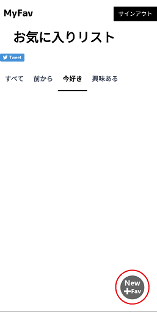
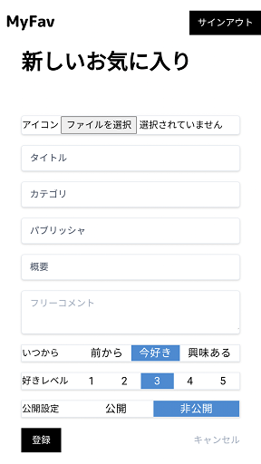
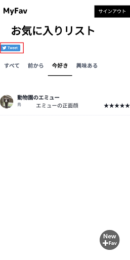

# MyFavの使い方

## Myfavとは
- Myfavは、「私のお気に入り」をまとめて、リストを作成・共有することができるサービスです。  
コンセプトは以下三つです  
    1. 自分の好きなものを一か所にまとめて、自分自身や友人に「私の好きなもの」を知ってもらいやすくすること
    1. これまでの好きなもの、今ハマっているもの、これからやってみたいものをすぐに確認できるようにすること
    1. SNSのプロフィール欄などをスッキリさせること（MyFavのリンクをプロフィールに貼ることでプロフィール欄を小さくできます）

## 使い方
- まず、アカウントを作成します。[サインアップ](https://www.s-myfav.com/newuser.html)  
  
ユーザー名とパスワード（２回）を入力して、サインアップボタンを押します。

- 作成したアカウントで、ログインします。[トップページ](https://www.s-myfav.com)  

- ログインしたら、右下のアイコンからお気に入りを作成できます。  

- 登録する項目は以下の通りです  

    - アイコン：一覧のアイコンに使用します。画像ファイルを選んでください。
    - タイトル：一覧に表示されるタイトルです。唯一の必須項目です。
    - カテゴリ：一覧に表示されるこのお気に入りのカテゴリです。自由に設定してください。
    - パブリッシャ：もとは「出版社」などの意味です。そのコンテンツなどを作っている人や組織などを自由に設定してください。
    - 概要：一覧に表示されるこのお気に入りの概要です。公開するお気に入りなどの場合概要説明を付けるとわかりやすいです。
    - フリーコメント:このお気に入りについての思いの丈を自由に書いてください。
    - いつから：一覧のタブ分けに使用します。このお気に入りを好きになったのはいつなのか、３段階に分けています。
    - 好きレベル：お気に入りの度合いを５段階で表せます。
    - 公開設定：このお気に入りを自分以外の方に公開するか、しないかを選べます。
  
- 登録すると、リストに戻ります。リストのツイートアイコンを押すと、Twitterでリストのリンクを呟けます。  

## 使用例
ここからは、こんな用途で使えます。という例を記載します。

### 自分の趣味タスクリストとして
- こんなことありませんか？  
多趣味な方、様々なことに興味がわいて、いくつもの事柄を並行して楽しんでしまう方。  
気づいたらいくつも積もり積もって全部中途半端…ということはないでしょうか。  
このMyFavを使うと自分が今何をやっている途中で、これから何に興味があって、これまでいくつの趣味を経てきたか、リストアップできます。

- こんなことありませんか？  
　友人と以前は同じものに熱中していたけど、実は今はちょっと違うものを楽しんでいる。今も好きじゃなくなったわけじゃないが、ハマってはいない  
そんなとき、MyFavの「今好き」ステータスから「前から好き」ステータスに移し、「今好き」ステータスには今ハマっていることを登録すれば、あなたが今何に熱中しているのかみんなもわかります。  
あとは更新後のリストをツイートしておきましょう。

### 管理人の連絡先
- [Twitterアカウント](https://twitter.com/i_k_r_m_s_)へご連絡ください。  
ある程度の開発段階ごとにバージョンアップする形でリリースしています。個人開発ですので、バグの混入や仕様面で至らないところがあるかと思います。  
上記リンクから、私のアカウントへリプくだされば、できる限り対応します。（必ず対応するかはわかりません）  
どうぞ、よろしくお願いします。